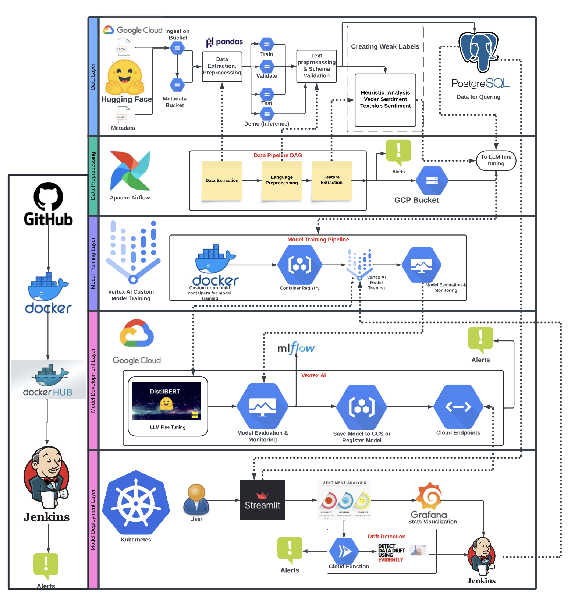

# Mlops: Customer-Review-Sentiment-Analyser

## Project Overview
This project aims to use Large language models and automate sentiment analysis for Amazon customer reviews using an MLOps pipeline that handles data ingestion, training, and deployment in a scalable and efficient way. The system is designed for continuous monitoring and retraining based on data drift.

This project leverages  MLOps best practices to analyze Amazon customer reviews. Designed with scalability, efficiency, and automation in mind, it provides actionable insights for e-commerce sellers, enabling them to make data-driven decisions.


### Architecture Diagram:



### KEY Features

1. Data Pipeline
* Automated data ingestion, preprocessing, and transformation using Apache Airflow.
* Data versioning with DVC and storage in Google Cloud Storage (GCS).
* Comprehensive schema validation and logging for robust data management.

2. Machine Learning Models
* Fine-tuned DistilBERT, RoBERTa, and ALBERT models for sentiment classification.
* Model selection based on performance metrics like accuracy, precision, recall, and F1-score.

3. Model Deployment
* Seamless deployment of the best model (DistilBERT) using Vertex AI.
* CI/CD pipeline implemented with Google Cloud Build and Jenkins for automated training, validation, and deployment.
* Monitoring and drift detection with Grafana, Google Cloud Monitoring, and Evidently AI.

4. E-commerce Dashboard
* Interactive Streamlit application hosted on Kubernetes.
* Real-time sentiment analysis and visualization of product performance and customer sentiment trends.


### Tech Stack

* Data Pipeline: Apache Airflow, DVC, Google Cloud Storage.
* Machine Learning: Transformers (Hugging Face), Tensorflow, DistilBERT, RoBERTa, ALBERT, Mlflow.
* Deployment: Vertex AI, Kubernetes, Docker, Google Artifact Registry.
* CI/CD: Jenkins.
* Monitoring: Grafana, Google Cloud Monitoring, Evidently AI.
* Frontend: Streamlit.

### Project Structure

```bash
.
├── data_pipeline/                  # Data pipeline files and Airflow DAGs
├── model/                          # Model development and training scripts
│   ├── distilbert/
│   ├── roberta/
│   └── albert/
├── deployment/                     # Deployment configurations and CI/CD pipelines
├── Jenkinsfile                     # CI/CD pipeline definition
├── Dockerfile                      # Docker configuration for deployment
├── requirements.txt                # Python dependencies
└── README.md                       # Project documentation
```

## Pipeline Workflow

1. Data Pipeline
* Ingests Amazon review data from Hugging Face datasets.
* Performs preprocessing steps such as:
* Removing HTML tags, URLs, and invalid entries.
* Merging review and metadata datasets.
* Applying feature engineering techniques for sentiment labeling (heuristic, VADER, TextBlob).

2. Model Development
* Fine-tunes DistilBERT, RoBERTa, and ALBERT using tokenized input data.
* Tracks experiments and metrics with MLflow.
* Bias detection with Fairlearn to ensure fair performance across product categories.

3. Model Deployment
* Deploys the best model (DistilBERT) to Vertex AI for real-time inference.
Automates deployment with GCP’s CI/CD pipelines and saves models to Google Artifact Registry.
Monitors model performance and triggers retraining upon detecting data drift.

4. Monitoring and Alerts
* Grafana Dashboards:
* Sentiment metrics (accuracy, F1-score, AUC).
* Sentiment trends and product performance.
* Google Cloud Monitoring:
* Tracks resource usage for Kubernetes, Cloud SQL, and Vertex AI endpoints.

5. Evidently AI:
* Detects data drift and triggers retraining pipelines.


## **Setup and Installation**

### **Prerequisites**
- Python 3.8+
- Docker and Docker Compose
- Google Cloud Platform (GCP) account
- PostgreSQL database setup

---

### **Steps**

1. **Clone the repository**:
   ```bash
   git clone https://github.com/madhurima-vanga/Amazon-Customer-Sentiment-Analyser.git
   cd Amazon-Customer-Sentiment-Analyser
   ```

2. **Install dependencies**:
   ```bash
   pip install -r requirements.txt
   ```

3. **Configure environment variables in `.env`**:
   ```env
   DB_HOST=<your-database-host>
   DB_PORT=<your-database-port>
   DB_NAME=<your-database-name>
   DB_USER=<your-database-user>
   DB_PASSWORD=<your-database-password>
   GOOGLE_APPLICATION_CREDENTIALS=<path-to-service-account-key.json>
   ```

4. **Run the Streamlit app**:
   ```bash
   streamlit run deployment/app_deployment/app.py
   ```


#### Contributing

We welcome contributions! Fork the repository, create a feature branch, and submit a pull request.

#### License

This project is licensed under the MIT License.